<div align="center">
  <h1>Precise Strapdown Inertial Navigation System<br>(PSINS)</h1>
  <h2>Toolbox for Matlab</h2>
  <p><strong>Version 2.0</strong><br>09/10/2015</p>
  <br><br>
  <p><strong>Gongmin Yan</strong><br>Northwestern Polytechnical University, Xi'an, P.R.China</p>
</div>

## Contents

- [1. Preface](#1-preface)
- [2. License](#2-license)
- [3. System Requirements](#3-system-requirements)
- [4. Quick Start](#4-quick-start)
- [5. Symbols & Conventions](#5-symbols--conventions)
- [6. Library Functions](#6-library-functions)
    - [6.1 Toolbox Initialization (psinsinit, glvs, glvf, psinsenvi)](#61-toolbox-initialization-psinsinit-glvs-glvf-psinsenvi)
    - [6.2 Askew Matrix & Cross Product (askew, iaskew, cros)](#62-askew-matrix--cross-product-askew-iaskew-cros)
    - [6.3 Attitude Conversion (a2qua, q2mat, q2att, q2mat, m2att, m2qua, attsyn, yawcvt)](#63-attitude-conversion-a2qua-q2mat-q2att-q2mat-m2att-m2qua-attsyn-yawcvt)
    - [6.4 Rotation Vector (rv2q, rv2m, q2rv, m2rv, rotv, qupdt, qupdt2, mupdt)](#64-rotation-vector-rv2q-rv2m-q2rv-m2rv-rotv-qupdt-qupdt2-mupdt)
    - [6.5 Quaternion Operation (qconj, qmul, qmulv, lq2m, rq2m)](#65-quaternion-operation-qconj-qmul-qmulv-lq2m-rq2m)
    - [6.6 Normalization (vnormlz, qnormlz, mnormlz)](#66-normalization-vnormlz-qnormlz-mnormlz)
    - [6.7 Platform Misalignment (qaddphi/qaddafa, qdelphi/qdelafa, qq2phi/ qq2afa)](#67-platform-misalignment-qaddphiqaddafa-qdelphiqdelafa-qq2phi-qq2afa)
    - [6.8 AVP & Pos Error Manipulation (avpset, avpseterr, avpadderr, avpcmp, posset, posseterr)](#68-avp--pos-error-manipulation-avpset-avpseterr-avpadderr-avpcmp-posset-posseterr)
    - [6.9 SIMU Manipulation (imuerrset, imuadderr, imurfu, imurot, imuresample)](#69-simu-manipulation-imuerrset-imuadderr-imurfu-imurot-imuresample)
    - [6.10 Coning & Sculling (cnscl, conecoef, conedrift, sculldrift, conepolyn, scullpolyn, conetwospeed)](#610-coning--sculling-cnscl-conecoef-conedrift-sculldrift-conepolyn-scullpolyn-conetwospeed)
    - [6.11 The Earth Related (earth, ethinit, ethupdate, p2cne, vn2dpos, pp2vn, la2dpos, xyz2blh, blh2xyz)](#611-the-earth-related-earth-ethinit-ethupdate-p2cne-vn2dpos-pp2vn-la2dpos-xyz2blh-blh2xyz)
    - [6.12 Attitude Determination by Vectors (sv2atti, dv2atti)](#612-attitude-determination-by-vectors-sv2atti-dv2atti)
    - [6.13 Initial Alignment (alignsb, alignvn, alignfn, aligni0, alignWahba, aligncmps)](#613-initial-alignment-alignsb-alignvn-alignfn-aligni0-alignwahba-aligncmps)
    - [6.14 SINS Algorithm (insinit, insupdate, inslever, insextrap, inspure, altfilt, etm, dsins)](#614-sins-algorithm-insinit-insupdate-inslever-insextrap-inspure-altfilt-etm-dsins)
    - [6.14 DR Algorithm (drinit, drupdate, vf2vb)](#614-dr-algorithm-drinit-drupdate-vf2vb)
    - [6.15 Kalman Filter (kfinit, kffk, kfhk, kfc2d, kfupdate, kffeedback, avpmdf, psinstypedef, RLS, kfupdatesq, fusion, invbc)](#615-kalman-filter-kfinit-kffk-kfhk-kfc2d-kfupdate-kffeedback-avpmdf-psinstypedef-rls-kfupdatesq-fusion-invbc)
    - [6.16 Nonlinear Filter (ekf, ut, ukf, afamodel)](#616-nonlinear-filter-ekf-ut-ukf-afamodel)
    - [6.17 POS (POSProcessing, POSFusion, POSimu2gps, imugpssyn)](#617-pos-posprocessing-posfusion-posimu2gps-imugpssyn)
    - [6.18 Display (timebar, resdisp, att3ddemo)](#618-display-timebar-resdisp-att3ddemo)
    - [6.19 Plot (imuplot, insplot, inserrplot, avpcmpplot, gpsplot, dvlplot, pos2dplot, kfplot, POSplot, labeldef)](#619-plot-imuplot-insplot-inserrplot-avpcmpplot-gpsplot-dvlplot-pos2dplot-kfplot-posplot-labeldef)
    - [6.20 Sensor Simulation (conesimu, scullsimu, swaysimu, imustatic, att2wm, trjsegment, trjsimu, odsimu, bhsimu, gpssimu, trjEast/trjNorth/trjunilat)](#620-sensor-simulation-conesimu-scullsimu-swaysimu-imustatic-att2wm-trjsegment-trjsimu-odsimu-bhsimu-gpssimu-trjeasttrjnorthtrjunilat)
    - [6.21 I/O File Manipulation (imufile, avpfile, trjfile, pos2gpx, binfile, txtfile)](#621-io-file-manipulation-imufile-avpfile-trjfile-pos2gpx-binfile-txtfile)
    - [6.22 Angle Unit Conversion (r2d, r2dm, r2dms, d2r, dm2r, dms2r)](#622-angle-unit-conversion-r2d-r2dm-r2dms-d2r-dm2r-dms2r)
    - [6.23 Some Mathematical Algorithms (avar, apcorr, maest, sumn, meann, cumint, rgkt4)](#623-some-mathematical-algorithms-avar-apcorr-maest-sumn-meann-cumint-rgkt4)
    - [6.24 Markov Process Simulation (markov1, markov2, mkvq, ar1coefs)](#624-markov-process-simulation-markov1-markov2-mkvq-ar1coefs)
    - [6.25 Variable Manipulation (prealloc, setvals, nnts, varpack)](#625-variable-manipulation-prealloc-setvals-nnts-varpack)
    - [6.26 GNSS Toolkit](#626-gnss-toolkit)
        - [6.26.1 GPS](#6261-gps)
        - [6.26.2 BD](#6262-bd)
        - [6.26.3 GLONASS](#6263-glonass)
        - [6.26.4 IO](#6264-io)
    - [6.27 Others (aa2mu, aa2phi, att2c, datt2mu, avpinterp, i0fvp, gcctrl, vn2vbl, nzFtHk, glvfield)](#627-others-aa2mu-aa2phi-att2c-datt2mu-avpinterp-i0fvp-gcctrl-vn2vbl-nzfthk-glvfield)
    - [6.28 New Functions(datacut, wavefit, vpverify, quantiz, imusyn, breakpoint, cumint, imulever, imurepair, aligndp)](#628-new-functionsdatacut-wavefit-vpverify-quantiz-imusyn-breakpoint-cumint-imulever-imurepair-aligndp)
- [7. Demo Examples](#7-demo-examples)
    - [7.1 Coning & Sculling Motion](#71-coning--sculling-motion)
    - [7.2 Initial Alignment](#72-initial-alignment)
    - [7.3 Pure Inertial Navigation](#73-pure-inertial-navigation)
    - [7.4 SINS/GPS Integrated Navigation](#74-sinsgps-integrated-navigation)
    - [7.5 DR & SINS/DR Integrated Navigation](#75-dr--sinsdr-integrated-navigation)
    - [7.6 GNSS Navigation](#76-gnss-navigation)
- [8. Version History](#8-version-history)
- [9. Contacts](#9-contacts)
- [10. Algorithm Overview](#10-algorithm-overview)
    - [10.1 'Local-Level-North-Slaved' SINS Differential Equations](#101-local-level-north-slaved-sins-differential-equations)
    - [10.2 Discrete SINS Updating Algorithms](#102-discrete-sins-updating-algorithms)
        - [A) Attitude Updating](#a-attitude-updating)
        - [B) Velocity Updating](#b-velocity-updating)
        - [C) Position Updating](#c-position-updating)
    - [10.3 SINS Linear Error Propagation Models](#103-sins-linear-error-propagation-models)
    - [10.4 SINS Initial Align State-space Models on Pseudo-static Base](#104-sins-initial-align-state-space-models-on-pseudo-static-base)
        - [A) Small Misalignment Angle KF Model](#a-small-misalignment-angle-kf-model)
        - [B) Large Header Misalignment Angle EKF Model](#b-large-header-misalignment-angle-ekf-model)
        - [C) Large Misalignment Angle UKF Model](#c-large-misalignment-angle-ukf-model)
    - [10.5 SINS/GPS Integrated Models](#105-sinsgps-integrated-models)
    - [10.6 SINS/DR Integrated Models](#106-sinsdr-integrated-models)
        - [A) DR Algorithm](#a-dr-algorithm)
        - [B) DR Error Models](#b-dr-error-models)
        - [C) SINS/DR Integrated State-space Model](#c-sinsdr-integrated-state-space-model)
    - [10.7 Coning/Sculling Motion and the Error Compensation Algorithm](#107-coningsculling-motion-and-the-error-compensation-algorithm)
        - [A) Coning Algorithm](#a-coning-algorithm)
        - [B) Sculling Algorithm](#b-sculling-algorithm)
    - [10.8 Trajectory Profile & SIMU Sensor Simulation](#108-trajectory-profile--simu-sensor-simulation)
        - [A) Trajectory Profile Simulation](#a-trajectory-profile-simulation)
        - [B) SIMU Sensor Simulation](#b-simu-sensor-simulation)

## 1. Preface

Precise Strapdown Inertial Navigation System (PSINS) toolbox for Matlab is an open source program package, primarily developed for inertial-grade or higher grade inertial navigation system simulation and data processing. PSINS toolbox includes strapdown inertial sensor (gyro & accelerometer) sampling simulation, initial self-alignment simulation, pure SINS navigation algorithm simulation, SINS/DR & SINS/GPS integrated navigation simulation and many other useful routes, which are all implemented by a bunch of powerful library functions. The PSINS library functions are well modularized and organized, then they are easy to understand and master. Surely, PSINS toolbox has the capability to processing real SIMU and GPS sampling data with a little or even no modification. On the basis of this PSINS toolbox, users can quickly and conveniently set up an inertial navigation solution to achieve their specific purpose.

## 2. License

The PSINS toolbox is distributed under the BSD 2-clause license

(see [http://opensource.org/licenses/BSD-2-Clause](http://opensource.org/licenses/BSD-2-Clause)). Users are permitted to download, copy, modify and redistribute this toolbox freely as long as they comply with the following license.

Copyright (c) 2009-2015, Gongmin Yan, All rights reserved.

Redistribution and use in source and binary forms, with or without modification, are permitted provided that the following conditions are met:

1. Redistributions of source code must retain the above copyright notice, this list of conditions and the following disclaimer.

2. Redistributions in binary form must reproduce the above copyright notice, this list of conditions and the following disclaimer in the documentation and/or other materials provided with the distribution.

THIS SOFTWARE IS PROVIDED BY THE COPYRIGHT HOLDERS AND CONTRIBUTORS "AS IS" AND ANY EXPRESS OR IMPLIED WARRANTIES, INCLUDING, BUT NOT LIMITED TO, THE IMPLIED WARRANTIES OF MERCHANTABILITY AND FITNESS FOR A  PARTICULAR PURPOSE ARE DISCLAIMED. IN NO EVENT SHALL THE COPYRIGHT HOLDER OR CONTRIBUTORS BE LIABLE FOR ANY DIRECT, INDIRECT, INCIDENTAL, SPECIAL, EXEMPLARY, OR CONSEQUENTIAL DAMAGES (INCLUDING, BUT NOT LIMITED TO, PROCUREMENT OF SUBSTITUTE GOODS OR SERVICES; LOSS OF USE, DATA, OR PROFITS; OR BUSINESS INTERRUPTION) HOWEVER CAUSED AND ON ANY THEORY OF LIABILITY, WHETHER IN CONTRACT, STRICT LIABILITY, OR TORT (INCLUDING NEGLIGENCE OR OTHERWISE) ARISING IN ANY WAY OUT OF THE USE OF THIS SOFTWARE, EVEN IF ADVISED OF THE POSSIBILITY OF SUCH DAMAGE.

## 3. System Requirements

When developing this toolbox, the author's PC setting is:

Microsoft Windows 7 (SP1) + Matlab 8.2.0 (R2013b) + CPU 2.1GHz + RAM 2.0GB.

## 4. Quick Start

1. Copy the PSINS toolbox root folder `psins/`, including all subfolders and files, to your computer.
2. Run `psins/psinsinit.m` to initialize PSINS environment.
3. Run `psins/demos/test_SINS_trj.m` to generate a moving trajectory.
4. Run `psins/demos/test_SINS_GPS.m` to demonstrate SINS/GPS integrated navigation.
5. There are many demo examples in `psins/demos`, such as coning & sculling motion demonstration, initial alignment, pure inertial navigation and POS data fusion, etc.
6. Try to do some modification and put your exercise file under `psins/mytest`. Enjoy yourself and may you find something helpful!

## 5. Symbols & Conventions

1. SINS: Strapdown Inertial Navigation System.
2. GPS: Global Positioning System.
3. DR: Dead Reckoning.
4. SIMU: Strapdown Inertial Measurement Unit.
5. POS: Positioning Orientation System.
6. i-frame: inertial frame.
7. e-frame: ECEF(Earth-Center-Earth-Fix) frame.
8. n-frame: navigation reference frame, with E-N-U (East-North-Up) pointing orientations.
9. b-frame: carrier's body frame (i.e. SIMU frame), with X-Right, Y-Forward and Z-Up pointing orientations.
10. p-frame: computed navigation frame, misalignment angles from n-frame to p-frame usually denoted as 'phi'.
11. ts/fs: SIMU sampling interval / sampling frequency.
12. T or len: total simulation time or data length.
13. att/qnb/Cnb: att -- Euler's angles of body attitude, i.e. att = [pitch, roll, yaw], NOTE: yaw angle follows the right-handed system convention with range (-pi, pi]; qnb -- attitude quaternion representation; Cnb -- direct cosine matrix (DCM), i.e. the transformation matrix from n-frame to b-frame.
14. vn: body velocity, i.e. the n-frame linear velocity w.r.t e-frame.
15. pos: body geographic coordinates, pos = [lat, lon, hgt], where lat -- latitude, lon -- longitude, hgt -- height above sea level.
16. avp/avp0: avp = [att, vn, pos, t], t -- time tag. Usually, avp0 specifies the initial navigation parameters, i.e. avp0 = [att0,
    vn0, pos0].
17. eb/web/db/wdb: eb -- gyro constant drift error; web -- gyro angular random walk coefficient; db -- accelerometer constant bias; wdb -- accelerometer velocity random walk coefficient.
18. taug/taua: correlation time for gyro/accelerometer <var>1<sup>st</sup></var> order Markov process.
19. dKg/dKa: scale factor errors and misalignment errors for gyro/accelerometer triad.
20. imuerr: structure array including eb, web, db, wdb, taug, taua, dKg and dKa.
21. wm/vm: the increment of gyro angular/accelerometer velocity sampling data within ts. Sometimes, symbols wib/fb are used for gyro angular rate / accelerometer specific force.
22. imu: imu = [wm, vm, t], t -- time tag, each row of imu represents a SIMU incremental sample within [t-ts,t].
23. wnie/wnen/wnin: wnie -- the Earth's angular rate projection in n-frame; wnen -- the rotation rate due to body's linear motion on the Earth's surface; wnin = wnie+wnen.
24. gn: gravity vector.
25. phi/dvn/dpos: phi -- platform errors (small misalignment angles) from n-frame to p-frame; dvn -- velocity errors; dpos -- geographic position errors, dpos = [dlat, dlon, dhgt].
26. davp/davp0: davp = [phi, dvn, dpos, t]. Usually, davp0 specifies the initial avp error, i.e. davp0 = [phi0, dvn0, dpos0].
27. eth: structure array, containing some important/useful parameters related to the Earth's navigation model.
28. trj: trajectory simulation result, including SIMU sensor outputs and trajectory avp references, etc.
29. ins: structure array for SINS updating algorithm.
30. kf: Kalman filter structure array.
31. xkpk: the results of Kalman filter updating, including state estimation, diagonal of covariance matrix and time tag, i.e. xkpk = [kf.xk, diag(kf.Pxk), t].

## 6. Library Functions

### 6.1 Toolbox Initialization (psinsinit, glvs, glvf, psinsenvi)

psinsinit: PSINS toolbox initialization, run this script first before using this toolbox.

glvs, glvf: PSINS toolbox global variable structure initialization.

psinsenvi: PSINS toolbox environment setting.

### 6.2 Askew Matrix & Cross Product (askew, iaskew, cros)

askew/iaskew: conversion between 3x1 vector and its askew matrix.

If <var>V = [x, y, z]<sup>T</sup></var> and <var>M</var> is its askew matrix, then <var>askew(V) = M</var>, <var>iaskew(M) = V</var>.

```math
\mathbf{M} =
\begin{bmatrix}
0 & -z & y \\
z & 0 & -x \\
-y & x & 0
\end{bmatrix}
```

cros: the cross product of two 3-element vectors, it is about 25 times faster than Matlab lib-function 'cross'.

### 6.3 Attitude Conversion (a2qua, q2mat, q2att, q2mat, m2att, m2qua, attsyn, yawcvt)

a2qua, q2mat, q2att, q2mat, m2att, m2qua: These functions transform attitude representations between Euler's angles, quaternion and DCM, all the parameters represent the same body attitude.

attsyn: attitude synchronization

yawcvt: Euler yaw angle conversion to designated convention, such as from clockwise yaw (0 -> 360 deg) to counter-clockwise yaw (-180 -> 180 deg).

### 6.4 Rotation Vector (rv2q, rv2m, q2rv, m2rv, rotv, qupdt, qupdt2, mupdt)

rv2q, rv2m, q2rv, m2rv: transformations between rotation vector and quaternion, or between rotation vector and matrix.

rotv: rotate a 3x1 vector by a rotation vector.

qupdt, qupdt2: attitude quaternion updating using rotation vector.

mupdt: attitude matrix (DCM) updating using rotation vector.

### 6.5 Quaternion Operation (qconj, qmul, qmulv, lq2m, rq2m)

qconj: quaternion conjugation, `q = q^*`.

qmul: quaternion multiplication, `q = q1*q2`.

qmulv: 3x1 vector transformed by quaternion, then `q*v` is equivalent to `q2mat(q)*v`.

lq2m: convert quaternion to 4x4 matrix, so `q1*q2` is equivalent to `lq2m(q1)*q2`.

rq2m: convert quaternion to 4x4 matrix, so `q1*q2` is equivalent to `rq2m(q2)*q1`.

### 6.6 Normalization (vnormlz, qnormlz, mnormlz)

vnormlz: vector normalization, i.e. v = v / \|v\|.

qnormlz: quaternion normalization, i.e. q = q / \|q\|.

mnormlz: matrix normalization, i.e. m = m / \|m\|.

### 6.7 Platform Misalignment (qaddphi/qaddafa, qdelphi/qdelafa, qq2phi/ qq2afa)

The relationships between calculated quaternion, real quaternion and phi (or afa for large misalign angles), can be informally denoted as:

qaddphi/qaddafa: calculated quaternion = real quaternion + phi (or afa);

qdelphi/qdelafa: real quaternion = calculated quaternion - phi (or afa);

qq2phi/qq2afa: phi (or afa) = calculated quaternion - real quaternion;

### 6.8 AVP & Pos Error Manipulation (avpset, avpseterr, avpadderr, avpcmp, posset, posseterr)

avpset: avp (attitude, velocity & position) array initialization.

avpseterr: avp error array initialization.

avpadderr: add some errors to avp.

avpcmp: comparison of avp with reference avp0 to get error.

posset: position (geographic coordinates) initialization.

posseterr: position error initialization.

### 6.9 SIMU Manipulation (imuerrset, imuadderr, imurfu, imurot, imuresample)

imuerrset: structure array initialization for SIMU error setting.

imuadderr: add some errors to SIMU data.

imurfu: convert SIMU data to X-Right, Y-Forward, Z-Up pointing orientations.

imurot: rotate SIMU's b-frame by a small angle vector.

imuresample: re-sample SIMU data in a new sampling interval.

### 6.10 Coning & Sculling (cnscl, conecoef, conedrift, sculldrift, conepolyn, scullpolyn, conetwospeed)

cnscl: coning & sculling error compensation.

conecoef: the generation of coning error compensation coefficients.

conedrift: calculate the residual drift rate of coning compensation.

sculldrift: calculate the residual velocity drift rate of sculling compensation.

conepolyn: calculation of noncommutativity error using polynomial compensation method

scullpolyn: calculation of sculling error using polynomial compensation method.

conetwospeed: calculation of noncommutativity error using Savage two-speed compensation method

### 6.11 The Earth Related (earth, ethinit, ethupdate, p2cne, vn2dpos, pp2vn, la2dpos, xyz2blh, blh2xyz)

earth: calculation of the Earth related parameters.

ethinit: the Earth related parameters (structure array) initialization.

ethupdate: update the Earth related parameters.

p2cne: convert geographic position to transformation matrix (from e-frame to n-frame).

vn2dpos: convert velocity to position increment within specific time interval.

pp2vn: use differential positions to get average velocity.

la2pos: convert lever arm expressed in b-frame to position difference in n-frame.

xyz2blh, blh2xyz: conversion between ECEF Cartesian coordinates [x, y, z] and geographic coordinates [lat, lon, hgt].

### 6.12 Attitude Determination by Vectors (sv2atti, dv2atti)

sv2atti: using single-measurement vector to determine body attitude.

dv2atti: using double-measurement vectors to determine body attitude.

### 6.13 Initial Alignment (alignsb, alignvn, alignfn, aligni0, alignWahba, aligncmps)

alignsb: initial coarse align on static base using double-vector method.

alignvn: initial fine align using velocity as Kalman filter measurement.

alignvn: initial fine align using specific force as Kalman filter measurement.

aligni0: initial align using inertial-frame & double-vector method.

alignWahba: initial align using inertial-frame & Wahba method.

aligncmps: initial align using gyro-compass method.

### 6.14 SINS Algorithm (insinit, insupdate, inslever, insextrap, inspure, altfilt, etm, dsins)

insinit: SINS algorithm initialization.

insupdate: SINS algorithm updating.

inslever SINS lever arm monitoring or compensation.

insextrap SINS navigation parameter extrapolation with some time difference.

inspure: pure SINS algorithm for batch data processing.

altfilt: pure SINS altitude damping using Kalman filter.

etm: SINS linear error propagation model.

dsins: SINS differential equations.

### 6.14 DR Algorithm (drinit, drupdate, vf2vb)

drinit: Dead Reckoning(DR) structure array initialization.

drupdate: Dead Reckoning(DR) attitude and position updating.

vf2vb: transfer forward velocity along vehicle body to body frame velocity(vector).

### 6.15 Kalman Filter (kfinit, kffk, kfhk, kfc2d, kfupdate, kffeedback, avpmdf, psinstypedef, RLS, kfupdatesq, fusion, invbc)

kfinit: Kalman filter structure array initialization.

kffk: establish Kalman filter state transition matrix.

kfhk: establish Kalman filter measurement matrix.

kfc2d: convert continuous-time state model to discrete-time model.

kfupdate: linear Kalman filter time & measurement updating.

kffeedback: feedback of filter's state estimation to SINS.

avpmdf: SINS output modification by Kalman filter estimation.

psinstypedef: PSINS & Kalman filter type define for various systems.

RLS: Recursive Least Square filter.

Kfupdatesq: linear Kalman filter measurement updating using sequential method.

fusion: data fusion.

invbc: matrix inversion under 'bad condition number'.

### 6.16 Nonlinear Filter (ekf, ut, ukf, afamodel)

ekf: extended Kalman filter.

ut: unscented transformation.

ukf: unscented Kalman filter.

afamodel: large misalignment angle error model.

### 6.17 POS (POSProcessing, POSFusion, POSimu2gps, imugpssyn)

POSProcessing: POS forward and backward data processing.

POSFusion: POS data fusion for forward and backward results.

imugpssyn: IMU & GPS time synchronization.

### 6.18 Display (timebar, resdisp, att3ddemo)

timebar: PSINS Toolbox waitbar to show the program running process.

resdisp: display the result associated with a pre-leading information string.

att3ddemo: display attitude motion in 3-D coordinate system.

### 6.19 Plot (imuplot, insplot, inserrplot, avpcmpplot, gpsplot, dvlplot, pos2dplot, kfplot, POSplot, labeldef)

imuplot: plot SIMU sensor data, i.e. gyro & accelerometer.

insplot: plot navigation results.

inserrplot: plot navigation error results.

avpcmpplot: AVPs comparison & errors plot.

gpsplot: plot GPS velocity, position and tracks.

dvlplot: plot dvl or odmeter velocity.

pos2dplot: plot multi 2D-positions/longitude-latitude in a figure.

kfplot: plot Kalman filter state estimation and state covariance.

POSplot: plot POS forward, backward and fusion results.

labeldef: define special labels for conciseness.

### 6.20 Sensor Simulation (conesimu, scullsimu, swaysimu, imustatic, att2wm, trjsegment, trjsimu, odsimu, bhsimu, gpssimu, trjEast/trjNorth/trjunilat)

conesimu: coning angular motion simulation.

scullsimu: sculling motion simulation.

swaysimu: sway simulation with pitch,roll,yaw(center-,inner-,outer-frame) on turntable.

imustatic: SIMU gyro/acc output simulation on static base.

att2wm: in static base, transfer attitude to gyro increment outputs.

trjsegment: segment setting for trajectory simulation.

trjsimu: vehicular moving trajectory simulation.

odsimu: odometer distance increment simulation.

bhsimu: barometric altimeter output simulation.

gpssimu: GPS receiver's velocity & position simulation.

trjEast/trjNorth/trjunilat: trajectory simulation with east-west/north-south/ motion.

### 6.21 I/O File Manipulation (imufile, avpfile, trjfile, pos2gpx, binfile, txtfile)

imufile: create or read PSINS text-format SIMU file.

avpfile: create or read PSINS text-format AVP/GPS file.

trjfile: save or load trajectory `*.mat` format file.

pos2gpx: create a simple `*.gpx` format file applied to Google Earth to show tracks.

binfile: save or load double-format binary file.

txtfile: save or load txt-format file.

### 6.22 Angle Unit Conversion (r2d, r2dm, r2dms, d2r, dm2r, dms2r)

Convert angle unit between radian and arcdeg / [arcdeg,arcmin] / [arcdeg,arcmin,arcsec].

NOTE: dm=1234.56 or dm=[12, 34.56] means `dm=12*arcdeg+34.56*arcmin`,

dms=123456.78 ro dms=[12, 34, 56.78] means

`dms=12*arcdeg+34*arcmin+56.78*arcsec`

dm=-1234.56 or dm=[-12, 34.56] means `dm=-(12*arcdeg+34.56*arcmin)`

### 6.23 Some Mathematical Algorithms (avar, apcorr, maest, sumn, meann, cumint, rgkt4)

avar: Allan variance analysis.

apcorr: plot and return auto-correlation & partial-correlation of a time-series.

maest: parameter estimation for MA model.

sumn: sum successive n elements to form as one element.

meann: average successive n elements to form as one element.

cumint: cumulative integral of elements using trapezoidal integral method.

rgkt4: solve differential equation using Runge-Kutta method.

### 6.24 Markov Process Simulation (markov1, markov2, mkvq, ar1coefs)

markov1: 1<sup>st</sup> order Markov process simulation.

markov2: 2<sup>nd</sup> order Markov process simulation.

mkvq: calculate the white noise intensity of 1<sup>st</sup> order Markov process.

ar1coefs: AR(1) filter design.

### 6.25 Variable Manipulation (prealloc, setvals, nnts, varpack)

prealloc: pre-allocate memory for variables before being used in loop.

setvals: set several output variables to corresponding input values.

nnts: set subsample number, sampling interval and their product.

varpack: pack all of the input variables into a structure array.

### 6.26 GNSS Toolkit

#### 6.26.1 GPS

rinexReadN/rinexReadO: read RINEX-format navigation message (observation data) file.

satPosVel: calculate satellite position, clock error and velocity from ephemeris data.

rhoSatRec: calculate pseudo-range between satellites and receiver.

satPos2AzEl: Calculate satellite azimuth(s) and elevation(s).

cal2gpst: Convert GPST from calendar day/time to week/time.

lspvt: Calculate receiver's position using least square method.

lsVel: Calculate receiver's velocity using least square method.

topocent: transformation to topocentric coordinates.

Dblh2Dxyz: convert perturbation error in geographic coordinate to ECEF Cartesian coordinate.

DOP: calculate GPS positioning DOP values.

codesmooth: Smoothing of pseudorange with carrier phase.

saastamoinen: Compute tropospheric delay by standard atmosphere and saastamoinen model.

satVelCorr: Satellite velocities correction from transmit ECEF to reception ECEF.

#### 6.26.2 BD

bdsatPosVelBatch: Calculate satellite position(s), clock error(s) and velocity(s) from ephemeris.

bdKlobuchar: Ionospheric correction using Klobuchar model.

#### 6.26.3 GLONASS

glosatPosVel: Calculate GLONASS satellite position(s), clock error(s) and velocity(s) from ephemeris using Runge-Kutta method.

#### 6.26.4 IO

rnx210, rnx210n, rnx210o, rnx302, rnx302n, rnx302o RINEX file read.

obsEphLink: Create link between obs records and eph records.

obsplot: Satellite observation analysis and plot.

satplot: Plot satellite position on the polar sky.

pvtplot: Plot single point position results.

### 6.27 Others (aa2mu, aa2phi, att2c, datt2mu, avpinterp, i0fvp, gcctrl, vn2vbl, nzFtHk, glvfield)

aa2mu/aa2phi/ att2c: please see the scripts.

datt2mu: calculate the installation error angles form attitude 'att0' and attitude error 'datt'.

avpinterp: avp linear interpolation.

i0fvp: calculate fi0,vi0,pi0 in i0-frame according to initial align time t.

gcctrl: calculate gyro-compass control coefficients.

vn2vbl: convert vector expressed in n-frame to b-level-frame.

nzFtHk: generate nonzero elements in Ft (SINS Error Transition Matrix).

glvfield: get structure field values from global 'glv'.

### 6.28 New Functions(datacut, wavefit, vpverify, quantiz, imusyn, breakpoint, cumint, imulever, imurepair, aligndp)

xxx.

## 7. Demo Examples

### 7.1 Coning & Sculling Motion

demo_cone_error: coning error compensation simulation.

demo_scull_error: sculling error compensation simulation.

demo_cone_motion: 3-D coning motion demonstration.

demo_scul_motion: 3-D sculling motion demonstration.

### 7.2 Initial Alignment

test_align_methods_compare:

demonstrate some SINS initial alignment methods and compare the results.

test_align_methods_compare_lgimu: demonstrate & compare alignment methods using real SIMU data.

test_align_transfer_trj/test_align_transfer_imu_simu/test_align_transfer:

master to slave SINS transfer alignment.

test_align_ekf: initial alignment using extended Kalman filter.

test_align_ukf: initial alignment using unscented Kalman filter.

### 7.3 Pure Inertial Navigation

test_SINS_static: pure inertial navigation on static base.

test_SINS_trj: trajectory simulation.

test_SINS: pure inertial navigation using trajectory data.

test_SINS_Runge_Kutta: pure inertial navigation using Runge_Kutta method.

test_SINS_east_west: SINS algorithm accuracy verification with analytical east-west trajectory.

test_SINS_error_model_verify: SINS linear-error-model propagation accuracy verification.

### 7.4 SINS/GPS Integrated Navigation

test_SINS_trj/test_SINS_GPS:

SINS/GPS integrated navigation using 15-state Kalman filter.

test_SINS_GPS_186: SINS/GPS integrated navigation using 18-state/6-dimension (velocity&position) Kalman filter.

test_SINS_GPS_19: SINS/GPS integrated navigation using 19-state Kalman filter.

test_POS_trj/ test_POS_fusion: POS dada processing and data fusion demonstration.

### 7.5 DR & SINS/DR Integrated Navigation

test_DR: dead recoding simulation.

test_SINS_DR: SINS/DR integrated navigation simulation.

### 7.6 GNSS Navigation

test_rnx_load_obs_view: GPS RINEX file load and observation data view.

test_satpv_accuracy_verify: GPS/BD/GLONASS satellite position/velocity calculating accuracy verification.

test_GPS_PVT: GPS position/velocity/time test.

test_GPS_PVT_codesmooth: GPS position/velocity/time test with code smoothing.

test_GPS_BD_GLONASS_PVT: GPS/BD/GLONASS position/velocity/time test.

test_GPS_SINS_static_tightly_coupled: GPS/SINS tightly-coupled integrated navigation.

## 8. Version History

1. 2009-02-05, (Ver. No. not available),

    [http://bbs.81tech.com/thread-132124-1-1.html](http://bbs.81tech.com/thread-132124-1-1.html)

2. 2012-02-03, (Ver. No. not available),

    [http://bbs.81tech.com/thread-316421-1-1.html](http://bbs.81tech.com/thread-316421-1-1.html)

3. 2013-09-16, (Ver. No. not available),

    [http://blog.sina.com.cn/s/blog_40edfdc90101heg0.html](http://blog.sina.com.cn/s/blog_40edfdc90101heg0.html)

4. 2014-04-13, (Ver. 1.0),

    [http://blog.sina.com.cn/s/blog_40edfdc90101heg0.html](http://blog.sina.com.cn/s/blog_40edfdc90101heg0.html)

5. 2014-06-03, (Ver. 1.1),

    [http://blog.sina.com.cn/s/blog_40edfdc90101heg0.html](http://blog.sina.com.cn/s/blog_40edfdc90101heg0.html)

6. 2015-03-15, (Ver. 1.5),

    [http://blog.sina.com.cn/s/blog_40edfdc90101heg0.html](http://blog.sina.com.cn/s/blog_40edfdc90101heg0.html)

7. 2015-08-25, (Ver. 2.0),

    [http://blog.sina.com.cn/s/blog_40edfdc90101heg0.html](http://blog.sina.com.cn/s/blog_40edfdc90101heg0.html)

## 9. Contacts

P. O. Box 183, School of Automation, Northwestern Polytechnical
University, 127 Youyi West Road, Xi'an 710072, P. R. China (in Chinese:
西安市友谊西路127号西北工业大学自动化学院183#；邮编710072)

Tel/Fax: +86-029-88431369

E-mail: <yangongmin@163.com>

QQ: 468195931

## 10. Algorithm Overview

### 10.1 'Local-Level-North-Slaved' SINS Differential Equations

SINS attitude, velocity and position differential equations are given, respectively, as

<p align="center">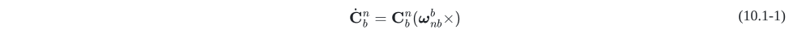</p>

<p align="center"></p>

<p align="center">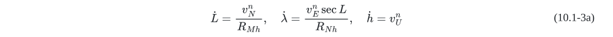</p>

or

<p align="center">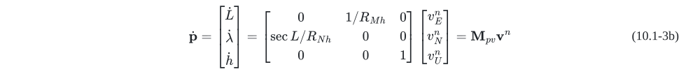</p>

where:

```math
\mathbf{f}_{sf}^{n} = \mathbf{C}_{b}^{n}\mathbf{f}_{sf}^{b}
```

```math
\boldsymbol{\omega}_{nb}^{b} = \boldsymbol{\omega}_{ib}^{b} - (\mathbf{C}_{b}^{n})^{T}\boldsymbol{\omega}_{in}^{n}
```

```math
\boldsymbol{\omega}_{in}^{n} = \boldsymbol{\omega}_{ie}^{n} + \boldsymbol{\omega}_{en}^{n}
```

```math
\boldsymbol{\omega}_{ie}^{n} =
\begin{bmatrix}
0 & \omega_{N} & \omega_{U}
\end{bmatrix}^{T}
=
\begin{bmatrix}
0 & \omega_{ie}\cos L & \omega_{ie}\sin L
\end{bmatrix}^{T}
```

```math
\boldsymbol{\omega}_{en}^{n} =
\begin{bmatrix}
\frac{v_{N}^{n}}{R_{Mh}} &
\frac{v_{E}^{n}}{R_{Nh}} &
\frac{v_{E}^{n}}{R_{Nh}}\tan L
\end{bmatrix}^{T}
```

```math
R_{Mh} = R_{M} + h, \quad R_{Nh} = R_{N} + h
```

```math
R_{M} = \frac{R_{N}(1 - e^{2})}{1 - e^{2}\sin^{2}L}, \quad R_{N} = \frac{R_{e}}{\sqrt{1 - e^{2}\sin^{2}L}}, \quad e = \sqrt{2f - f^{2}}
```

```math
\mathbf{g}^{n} =
\begin{bmatrix}
0 & 0 & -g
\end{bmatrix}^{T},
\quad g = g_{0}(1 + \beta_{1}\sin^{2}L + \beta_{2}\sin^{4}L) - \beta_{3}h
```

and where:

<var>C<sub>b</sub><sup>n</sup></var> : transformation DCM (Direct Cosine Matrix) from 'right-forward-up' body b-frame to 'east-north-up' navigation n-frame

```math
\boldsymbol{\omega}_{ib}^{b} =
\begin{bmatrix}
\omega_{ibx}^{b} & \omega_{iby}^{b} & \omega_{ibz}^{b}
\end{bmatrix}^{T}
```

```math
\mathbf{f}_{sf}^{b} =
\begin{bmatrix}
f_{sfx}^{b} & f_{sfy}^{b} & f_{sfz}^{b}
\end{bmatrix}^{T}
```
: gyro sensed angular rate & accelerometer sensed specific force

```math
\mathbf{v}^{n} =
\begin{bmatrix}
v_{E}^{n} & v_{N}^{n} & v_{U}^{n}
\end{bmatrix}^{T}
```
: velocity along east, north and up-vertical direction

```math
\mathbf{p} =
\begin{bmatrix}
L & \lambda & h
\end{bmatrix}^{T}
```
 , <var>L,λ,h</var> latitude, longitude and altitude above sea level

<var>R<sub>e</sub></var>: the Earth's semi-major axis, <var>R<sub>e</sub>= 6378137m</var>

<var>f</var>: the Earth's flattening, <var>f= 1/298.257</var>

<var>ω<sub>ie</sub></var>: the Earth's angular rate, <var>ω<sub>ie</sub>=7.2921151467E-5rad/s</var>

<var>g<sub>0</sub></var>: gravity magnitude at the equatorial sea-surface, <var>g<sub>0</sub>=9.7803267714m/s<sup>2</sup></var>

<var>β<sub>1</sub>,β<sub>2</sub>,β<sub>3</sub></var>:
```math
\beta_{1} = 5.27094 \times 10^{-3},\beta_{2} = 2.32718 \times 10^{-5},
```

```math
\beta_{3} = 2g_{0}/R_{e} = 3.086 \times 10^{- 6}(1/s^{2})
```

### 10.2 Discrete SINS Updating Algorithms

#### A) Attitude Updating

Using the chain rule of DCM production, <var>C<sub>b</sub><sup>n</sup></var> at time <var>t<sub>m</sub></var>, i.e. <var>C<sub>b<sub>m</sub></sub><sup>n<sub>m</sub></sup></var>, is constructed as

<p align="center">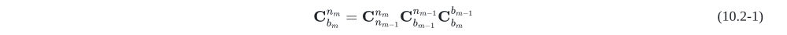</p>

where

<var>C<sub>b<sub>m - 1</sub></sub><sup>n<sub>m - 1</sub></sup></var> is the DCM at time <var>t<sub>m - 1</sub></var>.

<var>C<sub>n<sub>m - 1</sub></sub><sup>n<sub>m</sub></sup></var> is determined by rotation vector <var>ς<sub>m</sub></var> and
```math
\boldsymbol{\varsigma}_{m} = - \boldsymbol{\omega}_{in,m - 1/2}^{n}T_{m}
```
. The attitude updating interval is <var>T<sub>m</sub> = t<sub>m</sub> - t<sub>m - 1</sub></var>.

<var>C<sub>b<sub>m</sub></sub><sup>b<sub>m - 1</sub></sup></var> is determined by rotation vector <var>Φ<sub>m</sub></var>. If 2-sample coning compensation algorithm is applied, then we have <var>Φ<sub>m</sub> = Δθ<sub>m</sub> + 2/3 ·Δθ<sub>m</sub>(1) ×Δθ<sub>m</sub>(2)</var>. Here, <var>Δθ<sub>m</sub>(1),Δθ<sub>m</sub>(2)</var> are gyro angular increments within time intervals <var>[t<sub>m - 1</sub>, t<sub>m - 1/2</sub>]</var> and <var>[t<sub>m - 1/2</sub>, t<sub>m</sub>]</var>, and the total increment is <var>Δθ<sub>m</sub> = Δθ<sub>m</sub>(1) + Δθ<sub>m</sub>(2)</var>.

The relationship between DCM <var>C</var> and rotation vector <var>V</var> is given by

```math
\mathbf{C} = \mathbf{I} + \frac{\sin\lvert\mathbf{V}\rvert}{\lvert\mathbf{V}\rvert}(\mathbf{V} \times ) + \frac{1 - \cos^{2}\lvert\mathbf{V}\rvert}{\lvert\mathbf{V}\rvert^{2}}(\mathbf{V} \times )^{2}
```

#### B) Velocity Updating

<p align="center"></p>

<p align="center">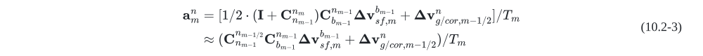</p>

<p align="center">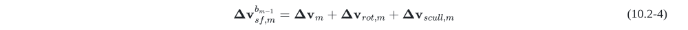</p>

<p align="center"></p>

where

<var>C<sub>n<sub>m - 1</sub></sub><sup>n<sub>m - 1/2</sub></sup></var> is determined by rotation vector <var>ς<sub>m</sub>/2</var>.

If the 2-sample sculling compensation algorithm is applied, then we have

<var>Δv<sub>m</sub> = Δv<sub>m</sub>(1) + Δv<sub>m</sub>(2)</var>,
```math
\boldsymbol{\Delta}\mathbf{v}_{rot,m} = 1/2 \cdot \boldsymbol{\Delta}\boldsymbol{\theta}_{m} \times \boldsymbol{\Delta}\mathbf{v}_{m}
```

and
```math
\boldsymbol{\Delta}\mathbf{v}_{scull,m} = \frac{2}{3}[\boldsymbol{\Delta}\boldsymbol{\theta}_{m}(1) \times \boldsymbol{\Delta}\mathbf{v}_{m}(2) + \boldsymbol{\Delta}\mathbf{v}_{m}(1) \times \boldsymbol{\Delta}\boldsymbol{\theta}_{m}(2)]
```

and where:

<var>Δv<sub>m</sub>(1),Δv<sub>m</sub>(2)</var> are accelerometer specific force increments within time intervals <var>[t<sub>m - 1</sub>, t<sub>m - 1/2</sub>]</var> and <var>[t<sub>m - 1/2</sub>, t<sub>m</sub>]</var>.

<var>v<sub>m - 1/2</sub><sup>n</sup></var> is obtained by extrapolation method:

```math
\mathbf{v}_{m - 1/2}^{n} = \mathbf{v}_{m - 1}^{n} + \mathbf{a}_{m - 1}^{n}T_{m}/2
```

#### C) Position Updating

<p align="center"></p>

<p align="center"></p>

The position information <var>p<sub>m - 1/2</sub></var> implied in the above notations <var>g<sub>m - 1/2</sub><sup>n</sup></var>, <var>ω<sub>in,m - 1/2</sub><sup>n</sup></var>, <var>ω<sub>ie,m - 1/2</sub><sup>n</sup></var>, <var>ω<sub>en,m - 1/2</sub><sup>n</sup></var> and <var>M<sub>pv,m - 1/2</sub></var> can also be calculated by extrapolation method:

```math
\mathbf{p}_{m - 1/2} = \mathbf{p}_{m - 1} + \mathbf{M}_{pv,m - 1}\mathbf{v}_{m - 1}^{n}T_{m}/2 \approx \mathbf{p}_{m - 1} + \mathbf{M}_{pv,m - 3/2}\mathbf{v}_{m - 1}^{n}T_{m}/2
```

### 10.3 SINS Linear Error Propagation Models

Under small disturbance assumption, the SINS error propagation satisfies the following equations:

<p align="center">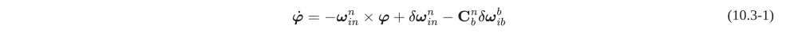</p>

<p align="center"></p>

<p align="center">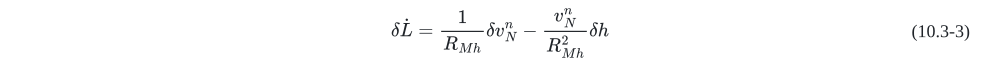</p>

<p align="center">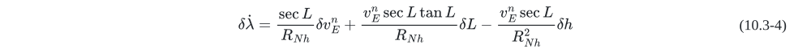</p>

<p align="center"></p>

Assume the gyro- and accelerometer-outputs are <var>ω<sub>ib</sub><sup>b</sup></var> and <var>f<sub>sf</sub><sup>b</sup></var>, then their corresponding errors are

```math
\boldsymbol{\delta}\boldsymbol{\omega}_{ib}^{b} = {\widetilde{\boldsymbol{\omega}}}_{ib}^{b} - \boldsymbol{\omega}_{ib}^{b} = \boldsymbol{\delta}\mathbf{K}_{g}\boldsymbol{\omega}_{ib}^{b} + \boldsymbol{\varepsilon}^{b}
```
  and
```math
\boldsymbol{\delta}\mathbf{f}_{sf}^{b} = {\widetilde{\mathbf{f}}}_{sf}^{b} - \mathbf{f}_{sf}^{b} = \boldsymbol{\delta}\mathbf{K}_{a}\mathbf{f}_{sf}^{b} + \nabla^{b}
```

where
```math
\boldsymbol{\delta}\mathbf{K}_{g} =
\begin{bmatrix}
\delta k_{gxx} & \delta k_{gxy} & \delta k_{gxz} \\
\delta k_{gyx} & \delta k_{gyy} & \delta k_{gyz} \\
\delta k_{gzx} & \delta k_{gzy} & \delta k_{gzz}
\end{bmatrix}
```
,
```math
\boldsymbol{\delta}\mathbf{K}_{a} =
\begin{bmatrix}
\delta k_{axx} & 0 & 0 \\
\delta k_{ayx} & \delta k_{ayy} & 0 \\
\delta k_{azx} & \delta k_{azy} & \delta k_{azz}
\end{bmatrix}
```
. And where

<var>δk<sub>gii</sub>,(i = x,y,z)</var> are gyro scale factor errors;
```math
\delta k_{gij},(i,j = x,y,z,i \ne j)
```
 are gyro actual axis misalignment angles with respect to ideal body frame axis; <var>δk<sub>aii</sub>,(i = x,y,z)</var> are accelerometer scale factor errors;
```math
\delta k_{aij},(i,j = x,y,z,i \neq j)
```
 are accelerometer actual axis misalignment angles with respect to ideal body frame axis.

 After some manipulation and arrangement, the above equations come to

<p align="center">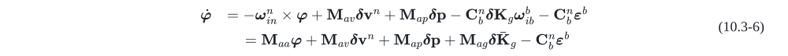</p>

<p align="center">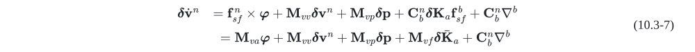</p>

<p align="center"></p>

where

```math
\boldsymbol{\varphi} =
\begin{bmatrix}
\varphi_{E} & \varphi_{N} & \varphi_{U}
\end{bmatrix}^{T}
```
: mathematical platform misalignment angles

```math
\boldsymbol{\delta}\mathbf{v}^{n} =
\begin{bmatrix}
\delta v_{E}^{n} & \delta v_{N}^{n} & \delta v_{U}^{n}
\end{bmatrix}^{T}
```
: velocity errors

```math
\boldsymbol{\delta} \mathbf{p} =
\begin{bmatrix}
\delta L & \delta\lambda & \delta h
\end{bmatrix}^{T}
```
: <var>δL,δλ,δh</var> represent latitude, longitude and altitude errors respectively

```math
\boldsymbol{\varepsilon}^{b} =
\begin{bmatrix}
\varepsilon_{x}^{b} & \varepsilon_{y}^{b} & \varepsilon_{z}^{b}
\end{bmatrix}^{T}
```
: gyro drift errors expressed in body frame

```math
\nabla^{b} =
\begin{bmatrix}
\nabla_{x}^{b} & \nabla_{y}^{b} & \nabla_{z}^{b}
\end{bmatrix}^{T}
```
: accelerometer biases expressed in body frame

```math
\boldsymbol{\delta}{\bar{\mathbf{K}}}_{g} =
\begin{bmatrix}
\delta k_{gxx} & \delta k_{gyx} & \delta k_{gzx} & \delta k_{gxy} & \delta k_{gyy} & \delta k_{gzy} & \delta k_{gxz} & \delta k_{gyz} & \delta k_{gzz}
\end{bmatrix}^{T}
```

```math
\boldsymbol{\delta}{\bar{\mathbf{K}}}_{a} =
\begin{bmatrix}
\delta k_{axx} & \delta k_{ayx} & \delta k_{azx} & \delta k_{ayy} & \delta k_{azy} & \delta k_{azz}
\end{bmatrix}^{T}
```

and where

<var>M<sub>aa</sub> = ( - ω<sub>in</sub><sup>n</sup> ×)</var> ,
```math
\mathbf{M}_{av} =
\begin{bmatrix}
0 & - 1/R_{Mh} & 0 \\
1/R_{Nh} & 0 & 0 \\
\tan L/R_{Nh} & 0 & 0
\end{bmatrix}
```
 , <var>M<sub>ap</sub> = M<sub>1</sub> + M<sub>2</sub></var>

```math
\mathbf{M}_{ag} =
- \begin{bmatrix}
\omega_{ibx}^{b}\mathbf{C}_{b}^{n} &
\omega_{iby}^{b}\mathbf{C}_{b}^{n} &
\omega_{ibz}^{b}\mathbf{C}_{b}^{n}
\end{bmatrix}
```

<var>M<sub>va</sub> = (f<sub>sf</sub><sup>n</sup> ×)</var>, <var>M<sub>vv</sub> = (v<sup>n</sup> ×)M<sub>av</sub> - ((2ω<sub>ie</sub><sup>n</sup> + ω<sub>en</sub><sup>n</sup>) ×)</var>, <var>M<sub>vp</sub> = (v<sup>n</sup> ×)(2M<sub>1</sub> + M<sub>2</sub>) + M<sub>3</sub></var>

```math
\mathbf{M}_{vf} =
\begin{bmatrix}
f_{sfx}^{b}\mathbf{C}_{b}^{n} &
f_{sfy}^{b}\mathbf{C}_{b}^{n}(:,2) &
f_{sfy}^{b}\mathbf{C}_{b}^{n}(:,3) &
f_{sfz}^{b}\mathbf{C}_{b}^{n}(:,3)
\end{bmatrix}
```
where <var>C<sub>b</sub><sup>n</sup>(:,i)</var> is the <var>i</var>-th column of <var>C<sub>b</sub><sup>n</sup></var>

```math
\mathbf{M}_{pv} =
\begin{bmatrix}
0 & 1/R_{Mh} & 0 \\
\sec L/R_{Nh} & 0 & 0 \\
0 & 0 & 1
\end{bmatrix}
```
 ,
```math
\mathbf{M}_{pp} =
\begin{bmatrix}
0 & 0 & - v_{N}^{n}/R_{Mh}^{2} \\
v_{E}^{n}\sec L\tan L/R_{Nh} & 0 & - v_{E}^{n}\sec L/R_{Nh}^{2} \\
0 & 0 & 0
\end{bmatrix}
```

```math
\mathbf{M}_{1} =
\begin{bmatrix}
0 & 0 & 0 \\
\omega_{ie}\sin L & 0 & 0 \\
\omega_{ie}\cos L & 0 & 0
\end{bmatrix}
```
 ,
```math
\mathbf{M}_{2} =
\begin{bmatrix}
0 & 0 & v_{N}^{n}/R_{Mh}^{2} \\
0 & 0 & - v_{E}^{n}/R_{Nh}^{2} \\
v_{E}^{n}\sec^{2}L/R_{Nh} & 0 & - v_{E}^{n}\tan L/R_{Nh}^{2}
\end{bmatrix}
```

```math
\mathbf{M}_{3} =
\begin{bmatrix}
0 & 0 & 0 \\
0 & 0 & 0 \\
- g_{0}\beta_{1}\sin 2L & 0 & \beta_{3}
\end{bmatrix}
```

In summary, SINS error propagation models can be described as the following state equation:

<p align="center">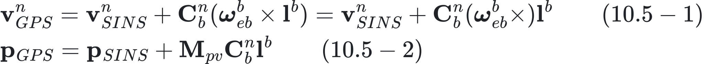</p>

where

```math
\mathbf{x} = \begin{bmatrix}
(\boldsymbol{\varphi})^{T} & (\boldsymbol{\delta}\mathbf{v}^{n})^{T} & (\boldsymbol{\delta} \mathbf{p})^{T} & (\boldsymbol{\varepsilon}^{b})^{T} & (\nabla^{b})^{T} & (\boldsymbol{\delta}{\bar{\mathbf{K}}}_{g})^{T} & (\boldsymbol{\delta}{\bar{\mathbf{K}}}_{a})^{T}
\end{bmatrix}^{T}
```

```math
\mathbf{F}_{SINS} = \begin{bmatrix}
\mathbf{M}_{aa} & \mathbf{M}_{av} & \mathbf{M}_{ap} & - \mathbf{C}_{b}^{n} & \mathbf{0}_{3 \times 3} & \mathbf{M}_{ag} & \mathbf{0}_{3 \times 6} \\
\mathbf{M}_{va} & \mathbf{M}_{vv} & \mathbf{M}_{vp} & \mathbf{0}_{3 \times 3} & \mathbf{C}_{b}^{n} & \mathbf{0}_{3 \times 9} & \mathbf{M}_{vf} \\
\mathbf{0}_{3 \times 3} & \mathbf{M}_{pv} & \mathbf{M}_{pp} & \mathbf{0}_{3 \times 3} & \mathbf{0}_{3 \times 3} & \mathbf{0}_{3 \times 9} & \mathbf{0}_{3 \times 6} \\
 & & & \mathbf{0}_{21 \times 30} & & &
\end{bmatrix}
```

The state components  <var>ε<sup>b</sup>,∇<sup>b</sup>,δK<sub>g</sub>,δK<sub>a</sub></var>  are all assumed to be constant vectors.

### 10.4 SINS Initial Align State-space Models on Pseudo-static Base

#### A) Small Misalignment Angle KF Model

On pseudo-static base, the SINS's position keeps constant and there is no velocity drift trend, so we can use a simplified version of SINS updating algorithm, as

<p align="center">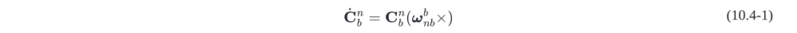</p>

<p align="center">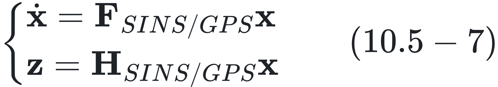</p>

where <var>ω<sub>nb</sub><sup>b</sup> = ω<sub>ib</sub><sup>b</sup> - (C<sub>b</sub><sup>n</sup>)<sup>T</sup>ω<sub>ie</sub><sup>n</sup></var>  ,
```math
\boldsymbol{\omega}_{ie}^{n} =
\begin{bmatrix}
0 & \omega_{ie}\cos L & \omega_{ie}\sin L
\end{bmatrix}^{T}
```
 ,
```math
\mathbf{g}^{n} =
\begin{bmatrix}
0 & 0 & -g
\end{bmatrix}^{T}
```
.

The corresponding error propagation models are

<p align="center">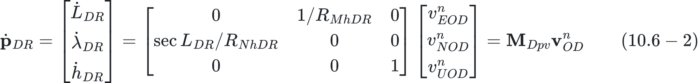</p>

<p align="center"></p>

Therefore, we obtain the KF state space model

<p align="center">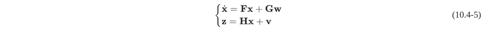</p>

where

```math
\mathbf{x} =
\begin{bmatrix}
(\boldsymbol{\varphi})^{T} &
(\boldsymbol{\delta}\mathbf{v}^{n})^{T} &
(\boldsymbol{\varepsilon}^{b})^{T} &
(\nabla^{b})^{T}
\end{bmatrix}^{T}
```
 ,
```math
\mathbf{w} =
\begin{bmatrix}
(\boldsymbol{\varepsilon}_{w}^{b})^{T} &
(\nabla_{w}^{n})^{T}
\end{bmatrix}^{T}
```

```math
\mathbf{F} =
\begin{bmatrix}
- \boldsymbol{\omega}_{ie}^{n} \times & \mathbf{0}_{3 \times 3} & - \mathbf{C}_{b}^{n} & \mathbf{0}_{3 \times 3} \\
\mathbf{f}_{sf}^{n} \times & \mathbf{0}_{3 \times 3} & \mathbf{0}_{3 \times 3} & \mathbf{C}_{b}^{n} \\
& \mathbf{0}_{6 \times 12} & &
\end{bmatrix}
```
 ,
```math
\mathbf{G} =
\begin{bmatrix}
- \mathbf{C}_{b}^{n} & \mathbf{0}_{3 \times 3} \\
\mathbf{0}_{3 \times 3} & \mathbf{C}_{b}^{n} \\
\mathbf{0}_{6 \times 3} & \mathbf{0}_{6 \times 3}
\end{bmatrix}
```

```math
\mathbf{H} =
\begin{bmatrix}
\mathbf{0}_{3 \times 3} &
\mathbf{I}_{3 \times 3} &
\mathbf{0}_{3 \times 3} &
\mathbf{0}_{3 \times 3}
\end{bmatrix}
```

where <var>ε<sub>w</sub><sup>b</sup></var>, <var>∇<sub>w</sub><sup>n</sup></var>, and <var>v</var> are gyro output noise, accelerometer output noise and velocity measurement noise respectively.

#### B) Large Header Misalignment Angle EKF Model

In this case, the SINS updating algorithm is the same as Eqs. (10.4-1) and (10.4-2). The large header error propagation models are established as

<p align="center">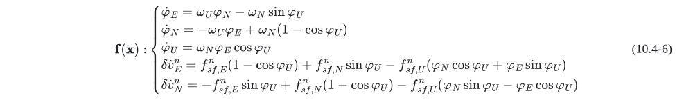</p>

Then, we get the EKF 5-state space model, neglecting gyro random constant drift error and accelerometer constant bias error, as

<p align="center">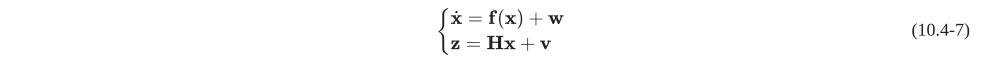</p>

where

```math
\mathbf{x} =
\begin{bmatrix}
\varphi_{E} & \varphi_{N} & \varphi_{U} & \delta v_{E}^{n} & \delta v_{N}^{n}
\end{bmatrix}^{T}
```
 ,
```math
\mathbf{w} =
\begin{bmatrix}
\varepsilon_{w,x}^{b} &
\varepsilon_{w,y}^{b} &
\varepsilon_{w,z}^{b} &
\nabla_{w,x}^{b} &
\nabla_{w,y}^{b}
\end{bmatrix}^{T}
```

```math
\mathbf{H} =
\begin{bmatrix}
\mathbf{0}_{2 \times 3} & \mathbf{I}_{2 \times 2}
\end{bmatrix}
```

For convenience, we give the Jacobian matrix of <var>f(x)</var> as follows

<p align="center">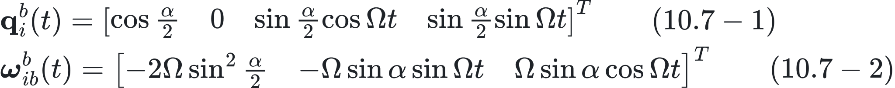</p>

```math
{J_{43} = f_{sf,E}^{n}\sin\varphi_{U} + f_{sf,N}^{n}\cos\varphi_{U} - f_{sf,U}^{n}( - \varphi_{N}\sin\varphi_{U} + \varphi_{E}\cos\varphi_{U})}
```

```math
{J_{53} = - f_{sf,E}^{n}\cos\varphi_{U} + f_{sf,N}^{n}\sin\varphi_{U} - f_{sf,U}^{n}(\varphi_{N}\cos\varphi_{U} + \varphi_{E}\sin\varphi_{U})}
```

#### C) Large Misalignment Angle UKF Model

In this case, the SINS updating algorithm is also the same as Eqs. (10.4-1) and (10.4-2), while the error propagation models are

<p align="center">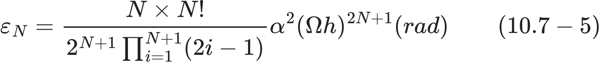</p>

where:

```math
\mathbf{C}_{\omega} = \begin{bmatrix}
c\alpha_{y} & 0 & - s\alpha_{y}c\alpha_{x} \\
0 & 1 & s\alpha_{x} \\
s\alpha_{y} & 0 & c\alpha_{y}c\alpha_{x}
\end{bmatrix}
```

```math
\mathbf{C}_{n}^{n'} = \begin{bmatrix}
c\alpha_{y}c\alpha_{z} - s\alpha_{y}s\alpha_{x}s\alpha_{z} & c\alpha_{y}s\alpha_{z} + s\alpha_{y}s\alpha_{x}c\alpha_{z} & - s\alpha_{y}c\alpha_{x} \\
 - c\alpha_{x}s\alpha_{z} & c\alpha_{x}c\alpha_{z} & s\alpha_{x} \\
s\alpha_{y}c\alpha_{z} + c\alpha_{y}s\alpha_{x}s\alpha_{z} & s\alpha_{y}s\alpha_{z} - c\alpha_{y}s\alpha_{x}c\alpha_{z} & c\alpha_{y}c\alpha_{x}
\end{bmatrix}
```

```math
\boldsymbol{\alpha} =
\begin{bmatrix}
\alpha_{x} & \alpha_{y} & \alpha_{z}
\end{bmatrix}^{T}
```
 represents large Euler misalignment angle vector. For concision, we use these denotations:

```math
s\alpha_{i} = \sin\alpha_{i},c\alpha_{i} = \cos\alpha_{i},(i = x,y,z)
```
.

For large misalignment nonlinear estimator, since the gyro random constant drift error and accelerometer constant bias error are very difficult to be identified, we simply need to establish a 6-state UKF model, as

<p align="center">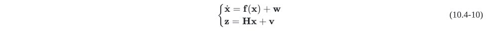</p>

where

<p align="center"></p>
 ,
<p align="center"></p>
 ,
<p align="center">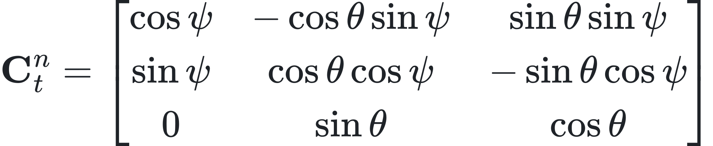</p>

### 10.5 SINS/GPS Integrated Models

Define the lever arm vector from SIMU calibration centre to GPS antenna centre as <var>l<sup>b</sup></var>, which is expressed in SIMU b-frame, then the velocities/positions between SINS and GPS are given by

<p align="center">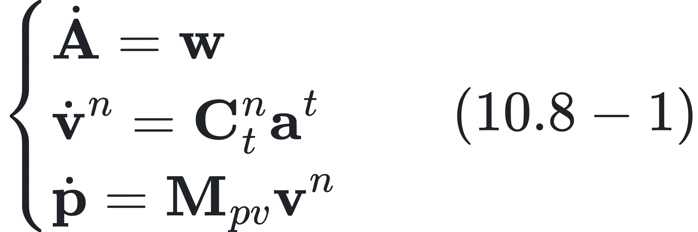</p>

<p align="center">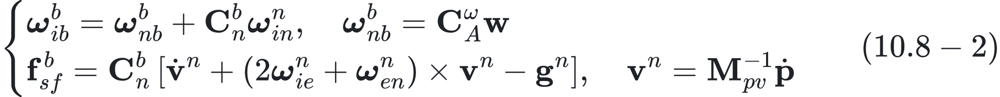</p>

On the other hand, if <var>τ</var> is denoted as the sampling time delay from SIMU to GPS, it satisfies

<p align="center">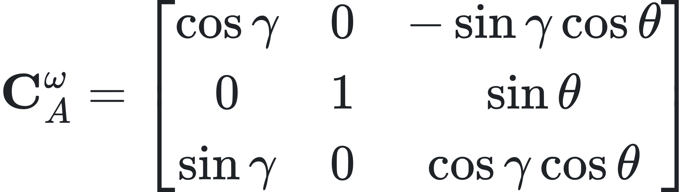</p>

<p align="center"></p>

Then, we construct the SINS/GPS velocity/position measurements as

<p align="center">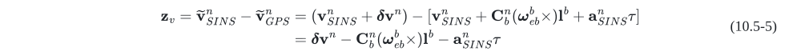</p>

<p align="center">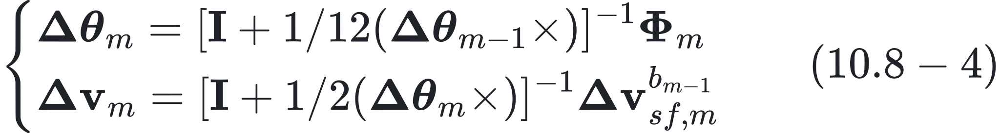</p>

Base on the above analysis, we obtain the 34-state SINS/GPS integrated models

<p align="center">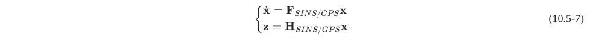</p>

where

<p align="center"></p>

<p align="center"></p>

<p align="center"></p>

<p align="center"></p>

The state components <var>l<sup>b</sup>,τ</var> are also assumed to be constant. Note that the processing noise and measurement noise are both neglected in model Eq. (10.5-7).

### 10.6 SINS/DR Integrated Models

#### A) DR Algorithm

The output of odometer is the distance increment <var>ΔS<sub>m</sub></var> at time interval <var>[t<sub>m - 1</sub>, t<sub>m</sub>]</var> along the car/vehicle forward direction. We define the average velocity as <var>v<sub>OD</sub> = ΔS<sub>m</sub>/T<sub>m</sub></var>, which can be seen as a continuous variable without loss of generality. Assume that <var>α<sub>θ</sub>,α<sub>ψ</sub></var> are, respectively, pitch and yaw misalignment angles from odometer/vehicle frame (o-frame) to SIMU b-frame. The odometer measured velocity expressed in b-frame is then written as

<p align="center">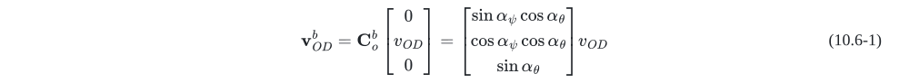</p>

Using the SINS Attitude DCM <var>C<sub>b</sub><sup>n</sup></var> to decompose velocity <var>v<sub>OD</sub><sup>b</sup></var>, we will get the following DR position update algorithm

<p align="center">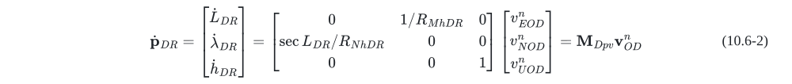</p>

The corresponding discrete DR algorithm of Eq. (10.6-2) is

<p align="center">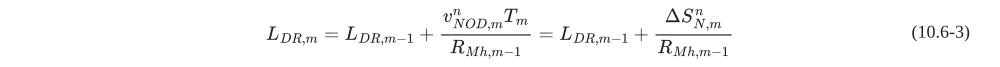</p>

<p align="center">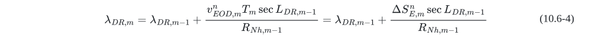</p>

<p align="center"></p>

where:

<p align="center"></p>

,

<p align="center"></p>
.

#### B) DR Error Models

The error contained odometer velocity  <var>v<sub>OD</sub><sup>n</sup></var> in actual DR system is expanded as

<p align="center">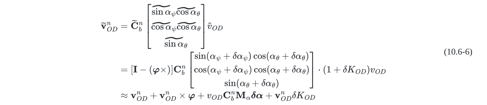</p>

where

<p align="center"></p>

and

<p align="center"></p>
are the residual errors of misalignment angles, and <var>δK<sub>OD</sub></var> is odometer scale factor error.

We rewrite Eq. (10.6-6) as

<p align="center"></p>

Now, by comparing with Eqs. (10.1-3b) and (10.3-8) and then considering Eqs. (10.6-2) and (10.6-7), lead to the DR position error model

<p align="center">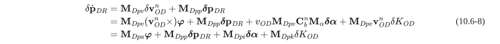</p>

where <var>M<sub>Dpa</sub> = M<sub>Dpv</sub>(v<sub>OD</sub><sup>n</sup> ×)</var>, <var>M<sub>Dpi</sub> = v<sub>OD</sub>M<sub>Dpv</sub>C<sub>b</sub><sup>n</sup>M<sub>α</sub></var>, and <var>M<sub>Dpk</sub> = M<sub>Dpv</sub>v<sub>OD</sub><sup>n</sup></var>.

#### C) SINS/DR Integrated State-space Model

The 22-state SINS/DR integrated system are modelled as

<p align="center">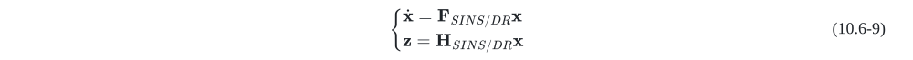</p>

where:

<p align="center"></p>

<p align="center"></p>

<p align="center"></p>

<p align="center"></p>

The state components <var>δα,δK<sub>OD</sub>,τ<sub>OD</sub></var> are also assumed to be constant, where <var>τ<sub>OD</sub></var> denotes the time asynchrony delay from odometer measured output to SIMU outputs.

### 10.7 Coning/Sculling Motion and the Error Compensation Algorithm

#### A) Coning Algorithm

Coning motion of b-frame with respect to some reference frame (i-frame) around x-axis can be described using quaternion/angular velocity as

<p align="center">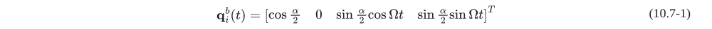</p>

<p align="center"></p>

where <var>α</var> is the half-apex angle and <var>Ω</var> is the coning frequency.

Integrating Eq. (10.7-2) over the sampling interval <var>[t<sub>m - 1</sub> + (i - 1)h, t<sub>m - 1</sub> + ih]</var>, gives angular increment vector as

<p align="center"></p>

Using <var>N</var>-subsample algorithm over the period <var>T<sub>m</sub> = t<sub>m</sub> - t<sub>m - 1</sub> = Nh</var>, a general rotation vector updating formula for coning compensation is:

<p align="center">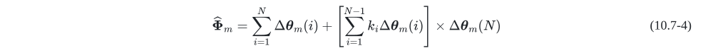</p>

where <var>k<sub>i</sub></var> are coning error compensation coefficients and are listed in Tab. 10-1 for <var>N = 2∼6</var>.

<p align="center">Tab. 10-1 Coning error compensation coefficients</p>

| <var>N</var> | <var>k<sub>1</sub></var> | <var>k<sub>2</sub></var> | <var>k<sub>3</sub></var> | <var>k<sub>4</sub></var> | <var>k<sub>5</sub></var> |
| :---: | :-------: | :-------: | :-------: | :-------: | :--------: |
|   2   |    2/3    |     -     |     -     |     -     |     -     |
|   3   |   9/20   |   27/20   |     -     |     -     |     -     |
|   4   |  54/105  |  92/105  |  214/105  |     -     |     -     |
|   5   |  250/504  |  525/504  |  650/504  | 1375/504 |     -     |
|   6   | 2135/4620 | 4558/4620 | 7296/4620 | 7834/4620 | 15797/4620 |

In <var>N</var>-subsample coning compensation algorithm, the un-compensated residual coning drift angle within the period <var>T<sub>m</sub></var> is

<p align="center">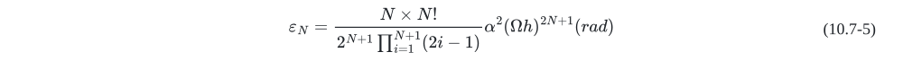</p>

#### B) Sculling Algorithm

In sculling motion environment, the angular velocity <var>ω<sub>ib</sub><sup>b</sup>(t)</var> and acceleration <var>a<sub>ib</sub><sup>b</sup>(t)</var> of b-frame with respect to reference i-frame are respectively described as

<p align="center"></p>

where <var>A<sub>θ</sub>,A<sub>p</sub></var> are angular/linear displacement amplitudes.

The corresponding velocity/position references expressed in i-frame are

<p align="center">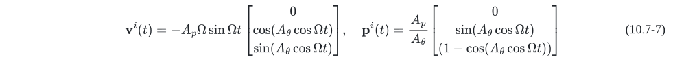</p>

While in b-frame, Eq. (10.7-7) comes to

<p align="center">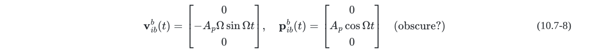</p>

Integrating Eq. (10.7-6), it leads to incremental information within sampling interval <var>[t<sub>m - 1</sub> + (i - 1)h, t<sub>m - 1</sub> + ih]</var>, as

<p align="center"></p>

<p align="center"></p>

Over the velocity updating period <var>T<sub>m</sub> = t<sub>m</sub> - t<sub>m - 1</sub> = Nh</var>, the <var>N</var>-subsample velocity increment is constructed as

<p align="center"></p>

where

<var>Δθ<sub>m</sub> = ∑<sub>i = 1</sub><sup>N</sup>k<sub>i</sub>Δθ<sub>m</sub>(i)</var>, <var>Δv<sub>m</sub> = ∑<sub>i = 1</sub><sup>N</sup>k<sub>i</sub>Δv<sub>m</sub>(i)</var>

<p align="center"></p>

<p align="center"></p>

In Eq. (10.7-11) the sculling compensation coefficients <var>k<sub>i</sub></var> are exactly the same as those listed in Tab. 10-1.

Similarly, in <var>N</var>-subsample sculling compensation algorithm, the un-compensated residual sculling drift velocity within the period <var>T<sub>m</sub></var> is

<p align="center"></p>

### 10.8 Trajectory Profile & SIMU Sensor Simulation

The SIMU sensor simulation can be seen as an inverse data processing problem of traditional SINS updating algorithm. The first step is to obtain an appropriate trajectory profile, including the vehicle's angular/linear displacement information, i.e. attitude function <var>A = [θ(t), γ(t), ψ(t)]<sup>T</sup></var> and position function <var>p = [L(t), λ(t), h(t)]<sup>T</sup></var> with respect to time.

#### A) Trajectory Profile Simulation

For description convenience, a new frame (t-frame) is defined, whose y-axis is along the trajectory forward direction, while x-axis is in the local level plane and points to the trajectory right direction, together with z-axis being a right-hand coordinate system. By contrast with <var>C<sub>b</sub><sup>n</sup></var>, it easy to obtain the transformation matrix from n-frame to t-frame, as

<p align="center"></p>

In our trajectory simulation scenario, the Euler angular rate <var>w = [θ&#775;, γ&#775;, ψ&#775;]<sup>T</sup> = [ω<sub>θ</sub>, ω<sub>γ</sub>, ω<sub>ψ</sub>]<sup>T</sup></var> and trajectory acceleration <var>a<sup>t</sup> = [a<sub>x</sub><sup>t</sup>, a<sub>x</sub><sup>t</sup>, a<sub>x</sub><sup>t</sup>]<sup>T</sup></var> are taken as original inputs to generate the profile [<var>A</var>, <var>p</var>], with the whole set of differential equations listed as follows.

<p align="center">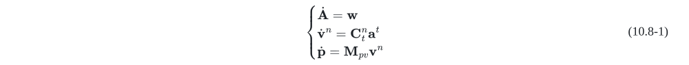</p>

Note that sideslip angle and attack angle are both not considered, or always equal 0, in the above trajectory integral models.

A trajectory profile is typically consists of several segments, such as uniform velocity, uniform acceleration, pitching, rolling and turning. The input parameters for each segment are described in brief as follows.

(1) Uniform velocity (including static): <var>w = [0, 0, 0]<sup>T</sup></var>, <var>a<sup>t</sup> = [0, 0, 0]<sup>T</sup></var>.

(2) Uniform acceleration: <var>w = [0, 0, 0]<sup>T</sup></var>, <var>a<sup>t</sup> = [0, a<sub>y</sub><sup>t</sup>, 0]<sup>T</sup></var>, where <var>a<sub>y</sub><sup>t</sup></var> is the acceleration along forward direction.

(3) Pitching: <var>w = [ω<sub>θ</sub>, 0, 0]<sup>T</sup></var>, <var>a<sup>t</sup> = [0, 0, 0]<sup>T</sup></var>, where <var>ω<sub>θ</sub></var> is the pitching angular rate.

(4) Rolling: <var>w = [0, ω<sub>γ</sub>, 0]<sup>T</sup></var>, <var>a<sup>t</sup> = [0, 0, 0]<sup>T</sup></var>, where <var>ω<sub>γ</sub></var> is the rolling angular rate.

(5) Turning: <var>w = [0, 0, ω<sub>ψ</sub>]<sup>T</sup></var>, <var>a<sup>t</sup> = [a<sub>x</sub><sup>t</sup>, 0, 0]<sup>T</sup></var>. If for coordinated flight, the constraints <var>a<sub>x</sub><sup>t</sup> = ω<sub>ψ</sub>v<sub>y</sub><sup>b</sup></var> and <var>a<sub>x</sub><sup>t</sup>/g = tanγ</var> should be satisfied.

#### B) SIMU Sensor Simulation

Beside the previous simulated method to generate the trajectory profile data [<var>A</var>, <var>p</var>], a high-precision SINS/GPS post-processing attitude and position results can also be applied to produce the profile, which may greatly improve the sense of reality, while this idea won't be discussed in detail here.

Based on section A), the formulae to generate SIMU sensor output are

<p align="center">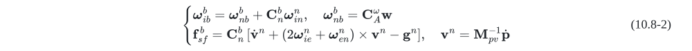</p>

where
<p align="center"></p>
<var>ω<sub>ib</sub><sup>b</sup>,f<sub>sf</sub><sup>b</sup></var> are gyro angular rate and accelerometer specific force outputs respectively.

Using the inverse concept of SINS algorithm, the discrete solution to obtain rotation vector and velocity increment for Eq. (10.8-2) is

<p align="center">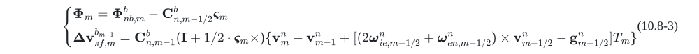</p>

where <var>ς<sub>m</sub> = ω<sub>in,m - 1/2</sub><sup>n</sup>T<sub>m</sub></var>, <var>Φ<sub>nb,m</sub><sup>b</sup> = [(C<sub>b,m - 1</sub><sup>n</sup>)<sup>T</sup>C<sub>b,m</sub><sup>n</sup>]<sub>M →RV</sub></var>, <var>v<sub>m</sub><sup>n</sup> = M<sub>pv,m - 1/2</sub><sup>-1</sup>(p<sub>m</sub> - p<sub>m - 1</sub>)</var>, and <var>[•]<sub>M →RV</sub></var> denotes the transformation from DCM to rotation vector, <var>T<sub>m</sub> = t<sub>m</sub> - t<sub>m - 1</sub></var> is the discrete time interval.

Considering the following attitude coning and velocity rotation effects

<p align="center"></p>

It comes to

<p align="center">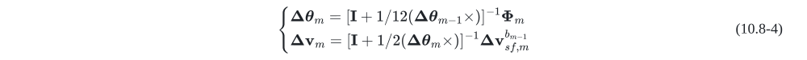</p>

## THE END OF THIS MANUAL
